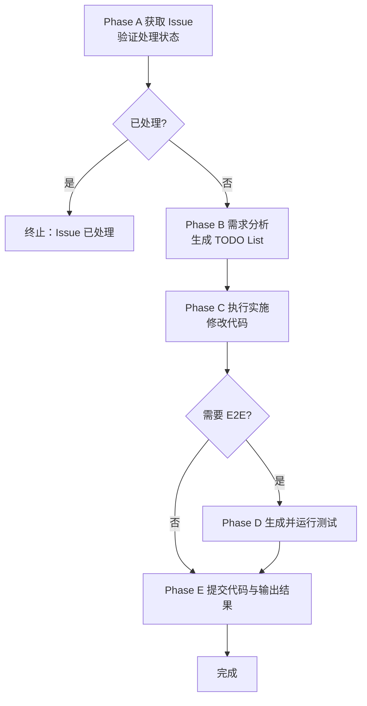

## Usage

```bash
# 使用 Issue ID
/issue-solve <ISSUE_ID>

# 使用 Issue URL
/issue-solve <ISSUE_URL>
```

### Prerequisites

- 已安装并登录 GitHub CLI：`gh auth status` 正常
- 当前工作目录为目标仓库根目录
- 本地分支可推送到远端（具备权限）
- 已配置好项目开发环境

## Context

- 该命令面向"Issue 从分析到解决的全流程自动化"，遵循智能分析 → 实现 → 测试 → 提交 → Review 的完整链路
- 使用 GH CLI 拉取 Issue 信息，分析需求，扫描代码库，自动生成并执行解决方案
- 对 backend 任务自动生成和运行 E2E 测试
- 完成后自动提交代码并创建 PR，随后进入 PR 修复流程

---

## Phase A: 获取与验证 Issue

### 1. 解析输入

- 接受 `<ISSUE_ID>` 或 `<ISSUE_URL>`
- 从 Issue URL 提取 `owner/repo` 和 `issue_number`
- 或从当前仓库 `git remote get-url origin` 推断 repo 信息

### 2. 拉取 Issue 完整信息

使用 GH CLI 获取 Issue 详细信息：

```bash
gh issue view <issue_number> --json number,title,body,state,labels,assignees,comments,author,createdAt,updatedAt,url
```

提取关键信息：
- Issue 标题与描述（需求背景）
- 标签（bug/feature/enhancement 等）
- 评论线程（补充说明、讨论记录）
- 当前状态（open/closed）

### 3. 检查处理状态（去重）

检查 Issue 是否已被处理：

**终止条件**（满足任一则终止流程）：
- Issue 状态为 `closed`
- 评论中包含 commit hash 引用（正则匹配：`[a-f0-9]{7,40}`）
- 评论中包含 PR 链接（正则匹配：`#\d+` 或 PR URL）
- 存在关联的已合并 PR：使用 `gh pr list --search "linked:issue-<number> is:merged"`

**终止输出**：

```
ℹ️ Issue #<number> 已被处理

检测到：
- 状态: <closed/已关联 PR/已有提交>
- 关联提交: <commit-hash>
- 关联 PR: #<pr-number>

任务已完成，无需重复处理。
```

**继续条件**：
- Issue 状态为 `open`
- 无关联提交或 PR
- 最近评论无明确"已解决"标记

### 4. 输出 Issue 概览

```
## 📋 Issue 信息

编号: #<number>
标题: <title>
状态: <state>
标签: <labels>
创建: <createdAt> by @<author>

需求描述:
<body 前 300 字>

评论数: <count>
<如有关键评论，摘要展示>

✅ Issue 未处理，继续执行解决流程
```

---

## Phase B: 需求分析与方案设计

### 1. 深度需求分析

基于 Issue 内容进行结构化分析：

**问题识别**：
- 核心问题是什么？（bug/新功能/优化/重构）
- 涉及哪些模块？（backend/front/admin/shared）
- 影响范围评估（文件数量、依赖关系）

**技术方案设计**：
- 列出可能的实现路径（2-3 个）
- 评估每个方案的复杂度与风险
- 选择最优方案并说明理由

**代码库扫描**：
- 使用 `codebase_search` 查找相关代码
- 识别需要修改的文件和函数
- 检查现有实现模式和约定
- 查找相似问题的历史解决方案

**依赖分析**：
- 是否需要数据库迁移？
- 是否需要更新 DTO/API？
- 是否影响前端接口？
- 是否需要更新文档？

### 2. 生成实施 TODO List

使用 `todo_write` 工具创建结构化任务清单：

**任务分类**：
- **准备阶段**：创建分支、环境检查
- **实现阶段**：按模块分解的具体任务
- **测试阶段**：E2E 测试生成与验证
- **提交阶段**：代码提交与 PR 创建
- **Review 阶段**：PR 修复与合并

**任务粒度**：
- 每个任务应该是独立、可验证的
- 包含明确的完成标准
- 标注预估工作量（简单/中等/复杂）

**示例 TODO**：

```
- [ ] 创建 issue 分支 feat/<issue-id>-<description>
- [ ] 修改 backend 模块 X 的 Y 功能
- [ ] 更新 DTO 定义（如需要）
- [ ] 运行数据库迁移（如需要）
- [ ] 生成/更新 E2E 测试
- [ ] 运行测试验证
- [ ] 执行增量预检
- [ ] 提交代码并创建 PR
- [ ] 处理 PR Review
```

> 建议在首次调用 `todo_write` 时一次性写入上述全流程任务，后续若需新增条目或调整顺序，使用 `merge: true` 更新同一份清单即可，避免重复创建多个 Todo 列表。

### 3. 方案确认与风险评估

**输出方案摘要**：

```
## 🎯 解决方案

问题类型: <bug/feature/enhancement>
涉及模块: <backend/front/admin>
预估复杂度: <简单/中等/复杂>

实施计划:
1. <步骤 1>
2. <步骤 2>
3. <步骤 3>

风险评估:
- ⚠️ <潜在风险 1>
- ⚠️ <潜在风险 2>

前置条件:
- <检查项 1>
- <检查项 2>

预计影响:
- 文件变更: ~<N> 个
- 测试需求: <是/否>
- 破坏性变更: <是/否>
```

---

## Phase C: 执行实施

### 1. 环境准备

**分支管理**：
- 检查当前分支：`git branch --show-current`
- 如在 `main`/`master`，创建新分支：

```bash
git checkout -b feat/<issue-id>-<description>
# 或
git checkout -b fix/<issue-id>-<description>
```

- 确保工作目录干净：`git status`

**环境验证**：
- 检查必要的服务是否运行（如需要）
- 验证开发环境配置

### 2. 逐步执行 TODO List

按 TODO List 顺序执行：

**实现规范**：
- 遵循项目代码规范和架构约定
- 保持文件结构清晰，避免无关修改
- 每个逻辑单元独立实现
- 实时更新 TODO 状态：`todo_write` 标记 `in_progress` → `completed`

**后端修改（如涉及）**：
- 遵循 NestJS 模块化架构
- 使用装饰器进行验证/授权
- 事务管理遵循 Issue #465 规范
- API 变更需添加 OpenAPI 装饰器

**前端修改（如涉及）**：
- 用户端：Next.js + Redux Toolkit + shadcn/ui
- 管理端：React + Vite + Ant Design + Zustand
- 优先使用 SDK 类型

**数据库变更（如涉及）**：

```bash
# 1. 修改 schema
vi apps/backend/prisma/schema/*.prisma

# 2. 格式化
./scripts/dx db format

# 3. 生成客户端
./scripts/dx db generate

# 4. 创建迁移
./scripts/dx db migrate --dev --name <migration-name>
```

**进度追踪**：
- 每完成一个 TODO，立即标记为 `completed`
- 遇到阻塞时，记录原因并标记为 `pending`
- 必要时调整 TODO 顺序或增补新任务

### 3. 代码质量保障

**实施过程中持续检查**：
- 代码风格符合项目规范
- 类型安全（禁止使用 `any`）
- 错误处理遵循统一错误码体系
- 避免过度设计和特殊分支（Good Taste 原则）

---

## Phase D: E2E 测试生成与验证

### 1. 判断是否需要 E2E 测试

**需要生成测试**（满足任一条件）：
- 修改了 backend 的 controller 或 service
- 新增或修改了 API 接口
- 修改了业务逻辑（特别是涉及数据库的）
- Issue 标签包含 `backend` 或 `api`

**跳过测试**：
- 纯前端 UI 修改
- 文档或配置变更
- 纯重构（无逻辑变更）

### 2. 生成 E2E 测试

**测试文件位置**：`apps/backend/e2e/`

**测试内容**：
- 覆盖新增/修改的 API 端点
- 测试正常流程和边界情况
- 验证错误处理（错误码、状态码）
- 检查数据库状态变更

**测试规范**：
- 使用项目已有的测试工具和模式
- 参考现有测试文件的结构
- 确保测试独立性（不依赖执行顺序）
- 包含必要的 setup 和 teardown
- 直接查阅 `apps/backend/e2e` 目录下同类模块的现有测试，尽量复用既有夹具与工具方法，避免重复编写初始化逻辑或自定义夹具

### 3. 运行测试验证

**识别受影响的测试**：
- 新生成的测试文件
- 可能受影响的现有测试（基于修改的模块）

**逐个运行测试**：

```bash
# 运行新增测试
./scripts/dx test e2e backend <new-test-file>

# 运行相关测试
./scripts/dx test e2e backend <related-test-dir>
```

**测试失败处理**：
- 分析失败原因
- 修复代码或测试
- 重新运行直到通过
- 不允许跳过失败的测试

**输出测试结果**：

```
## 🧪 E2E 测试结果

新增测试:
✅ apps/backend/e2e/feature-x.e2e-spec.ts

受影响的现有测试:
✅ apps/backend/e2e/related-module.e2e-spec.ts

测试通过: 15/15
测试失败: 0
```

---

## Phase E: 提交代码与创建 PR

### 1. 执行增量预检

按项目规范执行：

```bash
# 1. 代码检查（必跑）
./scripts/dx lint

# 2. 后端构建（如有后端修改）
./scripts/dx build backend

# 3. SDK 构建（如有 DTO/API 变更）
./scripts/dx build sdk --online

# 4. 前端构建（如有前端修改）
./scripts/dx build front
# 或
./scripts/dx build admin
```

**预检失败处理**：
- 修复所有错误
- 重新运行失败的检查
- 不允许在预检失败时提交

### 2. 检查 OpenAPI 变更

如执行了 `./scripts/dx build sdk --online`：

```bash
# 检查是否有 DTO/API 变更
git diff --name-only | grep -E '(\.dto\.ts|\.controller\.ts)$'

# 如果没有 DTO/API 变更，恢复 openapi.json
if [ $? -ne 0 ]; then
  git restore apps/sdk/openapi/openapi.json
fi
```

### 3. 输出提交结果

```
## ✅ 代码已提交

Issue: #<issue_id> <issue_title>
分支: <branch_name>
提交: <commit_hash> <commit_message>
PR: #<pr_number> <pr_title>
PR URL: <pr_url>

增量预检: ✅ 通过
E2E 测试: ✅ 通过（<count> 个测试）
```

---

## Execution Flow Summary



---

## Key Constraints

### Issue 验证

- ✅ 必须验证 Issue 存在且状态为 `open`
- ✅ 已处理的 Issue 必须终止流程，避免重复工作
- ✅ 检查评论中的提交和 PR 链接

### 需求分析

- ✅ 必须使用 `codebase_search` 扫描相关代码
- ✅ 方案设计需考虑项目架构和约定
- ✅ 识别破坏性变更并评估风险
- ✅ TODO List 必须结构化、可追踪

### 代码实施

- ✅ 遵循项目代码规范和架构约定
- ✅ 禁止使用 `any`，必须提供精确类型
- ✅ 错误处理遵循统一错误码体系
- ✅ 事务管理遵循 Issue #465 规范

### 测试要求

- ✅ Backend 修改必须生成 E2E 测试
- ✅ 测试必须覆盖正常和错误场景
- ✅ 所有测试必须通过才能提交
- ✅ 测试文件遵循项目测试模式

### 提交规范

- ✅ 必须在 issue 分支上工作
- ✅ 增量预检必须全部通过
- ✅ 使用 heredoc 格式提交
- ✅ 提交信息关联 Issue（`Refs: #<id>`）

### 流程完整性

- ✅ 提交与 PR 创建需遵循仓库规范（分支、提交信息、Issue 关联）
- ✅ 输出必须清晰展示每个阶段的结果
- ✅ 所有命令从仓库根目录执行

---

## Success Criteria

- ✅ **Issue 验证**：准确识别 Issue 处理状态，避免重复工作
- ✅ **需求分析**：深入理解需求，生成可执行的实施计划
- ✅ **代码质量**：符合项目规范，类型安全，架构合理
- ✅ **测试覆盖**：Backend 修改有完整 E2E 测试且全部通过
- ✅ **提交规范**：增量预检通过，提交信息规范，关联 Issue
- ✅ **PR 创建**：提交后创建 PR 并关联 Issue
- ✅ **Review 处理**：在 Review 阶段及时响应反馈并记录处理情况
- ✅ **流程闭环**：从 Issue 到 PR 合并的完整自动化

---

## Special Cases

### 场景 1：Issue 已处理（终止）

```
ℹ️ Issue #123 已被处理

检测到：
- 状态: closed
- 关联 PR: #456 (已合并)
- 处理时间: 2025-11-09

任务已完成，无需重复处理。

流程已终止。
```

### 场景 2：Issue 描述不清晰（询问）

```
⚠️ Issue #123 描述不够清晰

当前信息:
- 标题: <title>
- 描述: <body 前 100 字>

缺失信息:
- 具体的问题描述
- 期望的行为
- 复现步骤（如为 bug）

建议:
1. 在 Issue 中补充详细信息
2. 或告诉我你的理解，我将基于此继续

是否继续？(y/n)
```

### 场景 3：复杂需求需要拆分

```
⚠️ Issue #123 包含多个独立需求

检测到:
1. 需求 A: <描述>
2. 需求 B: <描述>
3. 需求 C: <描述>

建议:
- 将 Issue 拆分为多个独立 Issue
- 或按优先级逐个实现

推荐方案:
1. 先实现核心需求 A
2. 为 B、C 创建新 Issue

是否按此方案继续？(y/n)
```

### 场景 4：需要数据库迁移

```
⚠️ 检测到需要数据库迁移

变更:
- 新增表: <table_name>
- 修改字段: <field_changes>

迁移文件:
- apps/backend/prisma/migrations/<timestamp>_<name>/migration.sql

风险评估:
- 破坏性变更: <是/否>
- 需要数据迁移: <是/否>
- 回滚方案: <方案>

已生成迁移，继续执行实施。
```

### 场景 5：测试失败（修复）

```
❌ E2E 测试失败

失败测试:
- apps/backend/e2e/feature-x.e2e-spec.ts
  - should handle normal case ❌
    Expected: 200, Received: 400

分析:
- 错误原因: <分析>
- 需要修复: <具体代码位置>

正在修复...

修复完成，重新运行测试...

✅ 测试通过
```

---

## Examples

### 示例 1：简单 Bug 修复

```bash
# 输入
/issue-solve 123

# 流程
→ 拉取 Issue #123: "修复用户登录失败"
→ 分析：backend auth 模块错误处理问题
→ 生成 TODO: 3 个任务
→ 修改 auth.service.ts
→ 生成 E2E 测试
→ 运行测试通过
→ 执行增量预检
→ 提交代码并创建 PR #456（关联 Issue）
→ 根据 Review 情况跟进处理
→ 完成

总耗时: ~5 分钟
修改文件: 2 个
新增测试: 1 个
```

### 示例 2：新功能开发

```bash
# 输入
/issue-solve https://github.com/owner/repo/issues/789

# 流程
→ 拉取 Issue #789: "添加钱包提现功能"
→ 深度分析：需要 backend API + 数据库迁移 + 前端页面
→ 生成 TODO: 15 个任务
→ 创建分支 feat/789-wallet-withdrawal
→ 修改 Prisma schema
→ 生成迁移
→ 实现 backend 服务和控制器
→ 添加 OpenAPI 装饰器
→ 生成 E2E 测试（8 个用例）
→ 运行测试全部通过
→ 构建 SDK
→ 实现前端页面
→ 执行增量预检
→ 提交代码并创建 PR #790（关联 Issue）
→ 根据 Review 反馈持续跟进
→ 完成

总耗时: ~30 分钟
修改文件: 12 个
新增测试: 8 个
代码行数: +850 -50
```

### 示例 3：Issue 已处理（终止）

```bash
# 输入
/issue-solve 456

# 流程
→ 拉取 Issue #456
→ 检测状态: closed
→ 发现关联 PR #457 (已合并)
→ 发现提交 abc1234

## ℹ️ Issue #456 已被处理

检测到：
- 状态: closed
- 关联提交: abc1234
- 关联 PR: #457 (已合并于 2025-11-08)

任务已完成，无需重复处理。

流程已终止。
```

---

## Progress Tracking

- 复用在 Phase B 创建的 TodoWrite 清单作为唯一任务列表，后续仅通过 `todo_write`（`merge: true`）更新状态或追加条目。
- 初次写入清单时，可按阶段纳入以下事项作为参考：
  - Phase A：拉取 Issue 信息、验证处理状态
  - Phase B：需求分析、代码库扫描、生成 TODO List
  - Phase C：创建 issue 分支、执行代码修改
  - Phase D：生成 E2E 测试、运行测试验证
  - Phase E：执行增量预检、提交代码并创建 PR、输出结果汇总
- 若出现额外任务或阻塞项，在同一清单中新增即可，并及时更新每个条目的 `status`。

---

从 Issue 到合并，全流程自动化，高效解决问题，确保质量，闭环追踪！🚀


