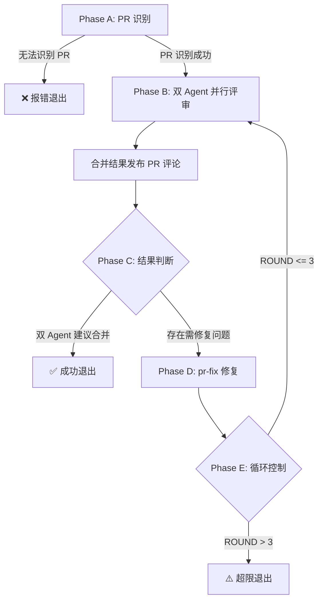

## Usage

```bash
# 自动识别当前分支对应的 PR
/pr-review-loop

# 显式指定 PR 编号
/pr-review-loop --pr <PR_NUMBER>
```

## 背景与约束

### 核心目标

- 编排多轮 PR 评审与自动修复流程
- 并行调用双审查 Agent（pr-review + review）进行多维度评审
- 合并评审结果并发布到 PR 评论
- 自动化修复 → 重新评审的闭环
- 最多 3 轮迭代，确保 PR 质量收敛

### 技术约束

- 支持自动识别当前分支对应的 PR
- 输出使用中文

---

## 工作流阶段

### Phase A：参数解析与 PR 识别

#### A.1 解析输入

1. 接受 `--pr <PR_NUMBER>` 或 `<PR_URL>`
   - 若提供：解析出 `pr_number`，直接使用

2. 若未提供 `--pr`，自动识别当前分支对应的 PR：
   ```bash
   # 获取当前分支名
   git branch --show-current

   # 查找当前分支关联的 PR
   gh pr list --head <BRANCH> --json number,title,url
   ```
   - 若找到唯一 PR：使用该 PR
   - 若找到多个 PR：提示用户选择
   - 若未找到 PR：报错退出
     ```
     ❌ 错误：当前分支没有关联的 PR

     请先创建 PR：gh pr create
     或显式指定：/pr-review-loop --pr <PR_NUMBER>
     ```

#### A.2 初始化循环控制

- 设置 `ROUND = 1`
- 设置 `MAX_ROUNDS = 3`
- 初始化 `REVIEW_HISTORY = []`

---

### Phase B：双 Agent 并行评审

> 循环入口点

#### B.1 输出当前轮次

```
🔄 第 ${ROUND}/${MAX_ROUNDS} 轮评审开始...
```

#### B.2 并行调用评审 Agent

同时调用两个评审 Agent，传入 PR 编号：

**Agent 1: pr-review**
```
调用 pr-review Agent，参数：
- PR 编号：<PR_NUMBER>

等待返回评审结果。
```

**Agent 2: review**
```
调用 review Agent，参数：
- PR 编号：<PR_NUMBER>

等待返回评审结果。
```

#### B.3 汇总评审结果

收集两个 Agent 的返回结果，提取关键信息：

| Agent | 结论 | 必改问题数 | 建议优化数 | 风险等级 |
|-------|------|-----------|-----------|----------|
| pr-review | 建议合并 / 修复后合并 / 需重大调整 | X | Y | 🔴/🟡/🟢 |
| review | 建议合并 / 修复后合并 / 需重大调整 | X | Y | 🔴/🟡/🟢 |

将本轮结果追加到 `REVIEW_HISTORY`。

#### B.4 合并评审结果并发布评论

将两个 Agent 的评审结果合并为一份综合报告，发布到 PR 评论：

```bash
gh pr comment <PR_NUMBER> --body "<MERGED_REVIEW_REPORT>"
```

**合并报告格式**：

```markdown
## 🔍 PR 综合评审报告 - 第 ${ROUND} 轮

### 评审摘要

| 评审维度 | 结论 | 必改问题 | 建议优化 | 风险等级 |
|----------|------|----------|----------|----------|
| 代码评审 (pr-review) | <结论> | X | Y | 🔴/🟡/🟢 |
| 多维度评审 (review) | <结论> | X | Y | 🔴/🟡/🟢 |

**综合结论**: <建议合并 / 修复后合并 / 需重大调整>

### 必须修复的问题

<合并 pr-review 和 review 的必改问题列表>

### 建议优化项

<合并两个 Agent 的优化建议>

### 后续步骤

<根据综合结论给出下一步建议>
```

---

### Phase C：评审结果判断

#### C.1 判断是否可直接合并

**合并条件**：两个 Agent 均返回"建议合并"

```python
if pr_review_result == "建议合并" and review_result == "建议合并":
    → 跳转 Phase E（成功退出）
else:
    → 继续 Phase D（修复流程）
```

#### C.2 输出判断结果

- 若可合并：
  ```
  ✅ 双 Agent 评审通过，PR 可合并
  ```

- 若需修复：
  ```
  ⚠️ 存在需要修复的问题，启动自动修复流程...

  pr-review 结论：<CONCLUSION>
  review 结论：<CONCLUSION>
  ```

---

### Phase D：自动修复

#### D.1 调用 pr-fix Agent

```
调用 pr-fix Agent，参数：
- PR 编号：<PR_NUMBER>

等待修复完成。
```

#### D.2 记录修复结果

收集 pr-fix Agent 返回的信息：
- 修复项数量
- Commit 列表
- 拒绝项及理由

---

### Phase E：循环控制与退出

#### E.1 检查循环次数

```python
ROUND += 1

if ROUND > MAX_ROUNDS:
    → 跳转 Phase F（超限退出）
else:
    → 返回 Phase B（继续下一轮）
```

#### E.2 成功退出（双 Agent 通过）

```
✅ PR 评审-修复流程完成

## 执行摘要

- PR 编号：#<PR_NUMBER>
- 总轮次：${ROUND} 轮
- 最终结果：✅ 双 Agent 评审通过

## 轮次历史

| 轮次 | pr-review 结论 | review 结论 | 修复数 |
|------|---------------|-------------|--------|
| 1    | ...           | ...         | X      |
| 2    | ...           | ...         | Y      |
| ...  | ...           | ...         | ...    |

## 后续动作

- [ ] 确认评审评论已发布到 PR
- [ ] 可执行合并操作
```

---

### Phase F：超限退出

当达到最大轮次仍未通过时：

```
⚠️ PR 评审-修复流程达到最大轮次限制

## 执行摘要

- PR 编号：#<PR_NUMBER>
- 已执行轮次：${MAX_ROUNDS} 轮
- 最终结果：⚠️ 未完全收敛

## 轮次历史

| 轮次 | pr-review 结论 | review 结论 | 修复数 |
|------|---------------|-------------|--------|
| 1    | ...           | ...         | X      |
| 2    | ...           | ...         | Y      |
| 3    | ...           | ...         | Z      |

## 剩余问题

<列出最后一轮仍存在的问题>

## 后续动作

- [ ] 人工审查剩余问题
- [ ] 手动修复后重新运行 `/pr-review-loop --pr <PR_NUMBER>`
- [ ] 或接受当前状态并手动合并
```

---

## 流程图



---

## Agent 调用规范

### pr-review Agent

```
请对 PR #<PR_NUMBER> 进行代码评审。

按照 pr-review Agent 的标准流程执行：
1. 获取 PR diff 与历史评论
2. 识别 Review 轮次与问题状态
3. 执行代码评审
4. 发布评审评论到 GitHub

返回结构化评审结果，包含：
- 结论：建议合并 / 修复后合并 / 需重大调整
- 必改问题数
- 建议优化数
- 风险等级
```

### review Agent

```
请对 PR #<PR_NUMBER> 进行多维度代码评审。

按照 review Agent 的标准流程执行：
1. 获取 PR diff 与元数据
2. 执行四维度评审（质量/安全/性能/架构）
3. 优先级排序（P0-P3）
4. 发布评审评论到 GitHub

返回结构化评审结果，包含：
- 结论：建议合并 / 修复后合并 / 需重大调整
- P0-P3 各级问题数
- 风险等级
```

### pr-fix Agent

```
请修复 PR #<PR_NUMBER> 中的评审问题。

按照 pr-fix Agent 的标准流程执行：
1. 获取 PR Review 与讨论数据
2. 分类评估并决定修复范围
3. 实施修复
4. 提交并同步

返回修复结果，包含：
- 修复项列表
- Commit 信息
- 拒绝项及理由
```

---

## Key Constraints

### PR 识别

- 支持 `--pr <PR_NUMBER>` 显式指定
- 若未提供 `--pr`，自动识别当前分支关联的 PR
- 若无法识别 PR（当前分支无关联 PR），报错退出

### 循环控制

- 最多执行 3 轮评审-修复循环
- 每轮都会完整执行双 Agent 评审
- 仅当双 Agent 都返回"建议合并"时才退出循环

### Agent 调用

- Phase B 的两个评审 Agent 必须**并行**调用
- Phase D 的 pr-fix Agent 按顺序调用
- 每个 Agent 调用需等待完成后再进行下一步

### 输出要求

- 全程使用中文输出
- 每轮开始时输出当前轮次
- 退出时输出完整的执行摘要

---

## Success Criteria

- ✅ 正确识别 PR（通过参数或自动识别当前分支）
- ✅ 并行调用 pr-review 和 review 两个 Agent
- ✅ 合并评审结果并发布到 PR 评论
- ✅ 正确判断双 Agent 结果，决定是否继续修复
- ✅ 调用 pr-fix 执行自动修复
- ✅ 循环控制正确，最多 3 轮
- ✅ 输出清晰的执行摘要与后续动作建议

---

## 示例场景

### 1. 自动识别当前分支 PR，首轮通过

```bash
/pr-review-loop

→ 识别当前分支：feat/add-user-auth
→ 查找关联 PR：#123

🔄 第 1/3 轮评审开始...
→ 并行调用 pr-review 和 review Agent
→ pr-review 结论：建议合并
→ review 结论：建议合并
→ 合并评审结果，发布 PR 评论

✅ 双 Agent 评审通过，PR 可合并

✅ PR 评审-修复流程完成
- 总轮次：1 轮
- 最终结果：✅ 双 Agent 评审通过
```

### 2. 显式指定 PR，经过 2 轮修复后通过

```bash
/pr-review-loop --pr 456

🔄 第 1/3 轮评审开始...
→ pr-review 结论：修复后合并（3 个必改问题）
→ review 结论：修复后合并（2 个 P0 问题）
→ 合并评审结果，发布 PR 评论

⚠️ 存在需要修复的问题，启动自动修复流程...
→ 调用 pr-fix Agent 修复

🔄 第 2/3 轮评审开始...
→ pr-review 结论：建议合并
→ review 结论：建议合并
→ 合并评审结果，发布 PR 评论

✅ 双 Agent 评审通过，PR 可合并

✅ PR 评审-修复流程完成
- 总轮次：2 轮
- 最终结果：✅ 双 Agent 评审通过
```

### 3. 达到最大轮次限制

```bash
/pr-review-loop --pr 789

🔄 第 1/3 轮评审开始...
→ 发现问题，修复...

🔄 第 2/3 轮评审开始...
→ 发现新问题，修复...

🔄 第 3/3 轮评审开始...
→ 仍有问题未解决

⚠️ PR 评审-修复流程达到最大轮次限制
- 已执行轮次：3 轮
- 剩余问题：...

后续动作：
- [ ] 人工审查剩余问题
```

### 4. 当前分支无关联 PR

```bash
/pr-review-loop

→ 识别当前分支：feat/new-feature
→ 查找关联 PR...

❌ 错误：当前分支没有关联的 PR

请先创建 PR：gh pr create
或显式指定：/pr-review-loop --pr <PR_NUMBER>
```

---

多轮评审，自动修复，质量闭环收敛。

