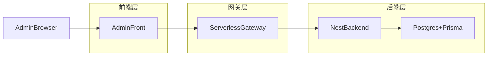

## 项目架构总览

当前项目是一个面向加密与金融场景的**数据聚合与分析展示系统**，整体形态为：

- 自建后端 API（NestJS + Prisma）
- Serverless 网关（API Gateway / Edge Functions 等）
- React 前端（用户站 + 管理后台）

代码采用 Nx Monorepo 组织，主要模块如下：

| 层级 / 模块      | 说明                                                          | 技术栈                                |
| ---------------- | ------------------------------------------------------------- | ------------------------------------- |
| apps/backend     | 面向前端与网关的统一 API 服务，负责数据聚合、清洗、权限与风控 | NestJS 11 + TS + Prisma 7             |
| apps/front       | 面向终端用户的数据展示站点（图表、报表、分析视图）            | Next.js 14 (React 19)                 |
| apps/admin-front | 管理后台（RBAC、菜单、系统配置、数据源管理等）                | Next.js 15 + React 19 + Redux Toolkit |
| packages/shared  | 前后端共享的 DTO、常量、工具函数（时间、金额、ID 等）         | TypeScript                            |
| packages/config  | 环境配置加载与 Zod 校验，统一 `.env` 层级                     | dotenv + zod                          |

> 说明：Serverless 网关通常部署在云端（如 API Gateway / Cloudflare Workers），不一定在本仓库中体现，这里将其视为“基础设施层”的一部分。

---

## 环境与配置

- 所有应用统一通过 `@net/config` 的 `loadEnvironment` 加载环境变量，保证本地 / e2e / 生产的 `.env` 行为一致。
- `.env.example`：敏感字段占位符，仅用于文档与提示。
- `.env.<env>`：可提交的非敏感配置。
- `.env.<env>.local`：本地私有配置（被 Git 忽略），由 `apps/*/scripts/check-env.js` 做必需项校验。

---

## 系统分层与职责边界

### 前端层（apps/front 与 apps/admin-front）

- 用户站（`apps/front`）：
  - 为终端用户提供图表、报表与可视化分析页面。
  - 只做展示层组合、交互与轻量级缓存，不做资金相关的核心运算与安全决策。
- 管理端（`apps/admin-front`）：
  - 提供 RBAC 后台：菜单配置、角色 / 管理员管理。
  - 提供系统级配置与数据源管理（如：市场交易对、策略模板、LLM 策略配置等，后续可按需要裁剪）。
  - 通过 HTTP 请求访问后端 API，统一由 `NEXT_PUBLIC_API_BASE_URL` 指向网关或后端。

前端层的基本约束：

- 不直接持有交易所 API Key 等敏感凭证。
- 不实现关键业务规则（风控、额度限制、资金曲线计算等），这些逻辑统一在后端实现。

### 网关层（Serverless Gateway）

网关层一般由云厂商提供，形态可以是 API Gateway + Functions、Edge Functions 等，本项目中主要承担：

- 请求入口统一点：
  - 终端用户站点与管理端所有 HTTP 请求先经过网关，再转发到 `apps/backend`。
- 鉴权与安全：
  - 校验 JWT / 会话令牌。
  - 可按路径 / 角色做基础访问控制。
- 流量治理：
  - 限流（按 userId / IP / API Key）。
  - 基础防护（IP 黑白名单、简单的 WAF 规则）。
- 路由与协议适配：
  - 将外部路径规范化，转发到后端对应的 Nest Controller。
  - 对需要 CORS / Header 注入的接口做统一处理。

不建议放在网关层的内容：

- 与数据库强相关的业务逻辑（订单、仓位、策略计算等）。
- 复杂的业务编排（多步调用、事务性写入）。

### 后端层（apps/backend）

后端是整个系统的业务中枢，代码位于 `apps/backend`，主要职责：

- 提供统一、稳定的 REST API。
- 与数据库交互（Prisma 7 + PostgreSQL），完成数据落库、查询与聚合。
- 实现 RBAC、系统设置、数据源配置、策略 / 信号等业务模块（旧业务已按 tsconfig 排除出编译，仅保留作参考）。
- 与外部数据源交互（交易所、链上数据、第三方行情 API 等），并做标准化和清洗。

典型结构：

- 启动与配置：
  - `src/main.ts`：Nest 启动入口，加载环境配置，注册全局管道、过滤器、拦截器等。
  - `src/config/**`：日志、S3、应用配置等。
- 领域模块（示例）：
  - `src/modules/admin`：后台管理相关模块（管理员、角色、菜单等）。
  - `src/modules/auth`：认证与授权（包括 `AppRole` 等）。
  - 其他历史业务模块（市场数据、策略实例、信号记录等），目前已通过 `apps/backend/tsconfig.json` 从编译中排除。
- 数据访问：
  - `apps/backend/prisma.config.ts`：Prisma 7 配置（datasource / generator / seed 入口）。
  - `apps/backend/prisma/schema/*.prisma`：拆分的 Prisma 模型定义（用户、管理员、角色、菜单、系统设置等）。
  - `apps/backend/src/prisma/prisma.service.ts`：
    - 使用 Prisma 7 + `@prisma/adapter-pg` 管理数据库连接池。
    - 封装事务与查询日志（慢查询告警等）。

---

## 请求流转示意

以管理端查询“后台菜单树”为例，请求链路如下：



简要说明：

1. 管理端 React 页面调用封装好的 API 函数（如 `fetchAdminMenus`），请求打到网关。
2. 网关完成鉴权、限流等基础校验后，将请求转发到 Nest 后端的对应 Controller。
3. 后端使用 Prisma 查询 `AdminMenu` 表，并构建菜单树结构返回。
4. 响应通过网关回传到前端，由 React 渲染为左侧菜单树。

终端用户站点（`apps/front`）的请求路径类似，只是访问的是面向用户的数据聚合 API（如资产概览、行情视图等）。

---

## 数据与种子

- 数据库：PostgreSQL，通过 Prisma 7 访问。
- Prisma 定义：
  - `prisma.config.ts` 统一配置 datasource / generator，并从 `DATABASE_URL` 读取连接串。
  - `prisma/schema/*.prisma` 中拆分各领域模型，例如：
    - `user_auth.prisma`：用户与认证模型。
    - `admin_rbac.prisma`：角色、后台用户、菜单与权限。
    - `system.prisma`：系统设置等。
- 种子数据（`apps/backend/prisma/seed.ts`）：
  - 初始化基础角色（USER / MODERATOR / ADMIN / SUPER_ADMIN）。
  - 初始化基础后台菜单（Dashboard、系统管理下的角色 / 菜单 / 管理员）。
  - 初始化默认管理员账号并绑定 SUPER_ADMIN 角色。

---

## 安全与运维基线

- 环境变量：
  - 所有应用通过 `@net/config` + `loadEnvironment` 加载 `.env.<env>(.local)`，并使用 Zod 校验必需项。
  - 生产环境推荐通过环境变量或密钥管理服务注入敏感信息，而非 `.env.prod.local` 文件。
- 认证与授权：
  - 后端统一通过 Auth 模块发放 / 校验 JWT。
  - 管理端使用 `AdminUser + Role + RoleAssignment + AdminMenu` 实现 RBAC。
- 日志与可观测性：
  - 后端使用 `logger.config.ts` 接入 Winston，按 `LOG_LEVEL` 与 `LOG_CONTEXT_FILTER` 控制输出。
  - Prisma 查询通过 `PrismaService` 中的逻辑打印慢查询日志。
  - 建议在网关层补充请求日志（path、status、latency、userId），并透传 traceId 到后端。

---

## 基础设施与 infra 布局（Serverless 网关）

为了把 Serverless 网关与业务后端解耦，同时又放在同一个仓库统一管理，推荐采用一个单独的 `infra` 目录：

- `infra/gateway/`：网关相关的基础设施定义
  - API Gateway / Edge Functions / Lambda 的路由与域名配置
  - 与 `apps/backend` 的转发关系（例如：`/api/v1/**` → 后端服务地址）
  - 若有少量网关函数代码，可在这里或单独 `apps/gateway` 项目中维护
- `infra/backend/`（可选）：后端服务的部署描述
  - K8s / ECS / Docker Compose 等部署文件
  - 与数据库、日志系统等依赖的连接配置

一个典型的目录示例（仅作为约定）：

```text
infra/
  gateway/
    README.md          # 网关职责、路由规则、部署方式
    api-gateway.yaml   # 例如 API Gateway 或其它 provider 的配置
  backend/
    README.md          # 后端部署说明
    k8s-deployment.yaml
```

约定：

- 业务逻辑始终留在 `apps/backend` 中，网关只做“入口”和“安全边界”。
- 如需写少量与网关强绑定的代码（例如 Edge Function 中的自定义鉴权），建议单独建应用：
  - `apps/gateway/`：只依赖少量库（JWT、日志、配置），不直接访问数据库。
  - `infra/gateway/`：描述该应用在云上的实际部署方式与路由。

---

## 后续演进方向（简要）

- 为终端用户站设计少量高层聚合 API（如 `/stats/portfolio-overview`、`/stats/strategy-performance`），在后端完成多源聚合与指标计算。
- 让 Serverless 网关尽量“瘦身”，只做通用网关能力，将复杂逻辑下沉到后端。
- 按照 RBAC 与系统设置模块，逐步裁剪旧业务入口，仅保留当前需要的管理功能。
