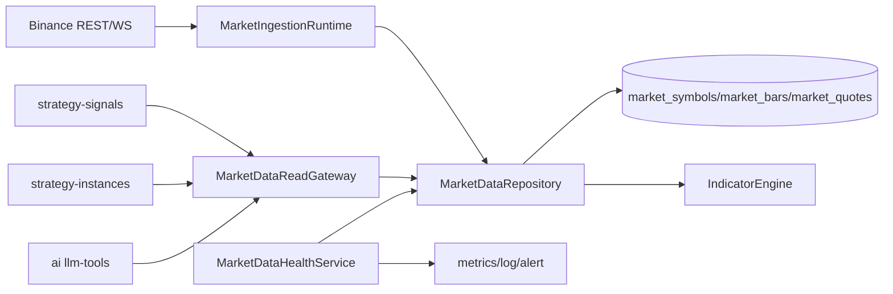

# Quantify 市场数据层 P0 设计（稳定性硬门槛 + 统一喂数契约）

日期：2026-03-17  
负责人：技术1（市场数据层）

## 1. 背景与目标

当前 `apps/quantify` 已具备 `market-data`、`indicators`、`strategy-signals`、`strategy-instances`、`ai` 等模块，但市场数据消费仍存在分散直查与可观测不足问题。

本期 P0 目标：

1. 市场数据采集链路达到稳定性硬门槛：不断流、可恢复、可补洞、可观测。
2. 在 quantify 进程内建立统一“喂策略数据契约”，供策略/AI 模块统一取数。

明确边界：

1. 市场数据仍在 quantify 进程内，不拆独立微服务。
2. quantify 对外统一 HTTP 接口收口，放在三位技术联调后执行（非本期 P0）。

## 2. 现状摘要（代码基线）

已实现：

1. Provider 抽象 + Binance 实现。
2. 启动自动同步 symbols、回补历史 bars、订阅实时 WS。
3. `Symbol / MarketBar / MarketQuote` 持久化模型与查询 API。
4. 新 bar 落库后触发指标计算。

已知问题：

1. 策略层和 AI 工具存在分散直查 `marketBar/symbol`。
2. 缺少市场数据层面的统一 read gateway 与统一错误语义。
3. 可观测维度不足（新鲜度、缺口、回补成效缺少统一指标）。
4. 文档存在运行端口/启动说明不一致（误指向 backend 3000）。

## 3. 方案对比与选择

### 3.1 方案A（推荐）

先建立稳定性硬门槛，同时落地统一喂数契约（读侧网关）。

优点：

1. 风险最低，联调前就能发现并消除数据质量问题。
2. 对现有代码侵入最小，改造路径可控。

缺点：

1. 需要同步调整 3 处消费者（signals/instances/ai-tools）。

### 3.2 方案B

先统一喂数契约，再补稳定性。

优点：

1. 读侧收敛更快。

缺点：

1. 采集端稳定性问题会在联调阶段集中暴露，返工概率高。

### 3.3 方案C

直接重构成事件驱动统一数据管线。

优点：

1. 长期架构整洁。

缺点：

1. 当前阶段成本过高，影响联调节奏。

结论：采用方案A。

## 4. P0 设计

### 4.1 模块职责（quantify 进程内）

1. `MarketIngestionRuntime`（基于现有 `market-data-ingestion.service` 增强）
- 负责 symbols 同步、历史回补、WS 订阅、重连与回收。

2. `MarketDataRepository`（新增抽象）
- 统一封装 `symbol/marketBar/marketQuote` 读写。
- 统一排序、limit、时间窗口约束，避免调用方重复实现。

3. `MarketDataHealthService`（新增）
- 计算数据新鲜度、缺口、回补结果。
- 暴露内部健康态与指标采集点。

4. `MarketDataReadGateway`（新增）
- 统一给策略/AI模块提供：
  - `getLatestQuote(symbol)`
  - `getRecentBars(symbol, timeframe, limit)`
  - `getIndicatorSnapshot(symbol, timeframe, fields)`
- 作为“喂策略契约”，替代分散直查。

### 4.2 数据流（P0）

### 4.3 错误处理规范

错误类型：

1. `ProviderError`：交易所 REST/WS 超时、断链、响应异常。
2. `DataGapError`：目标窗口内 bars 缺失。
3. `DataFreshnessError`：最新数据超出新鲜度阈值。
4. `ContractError`：symbol/timeframe/limit 等参数非法。

处理策略：

1. ingestion：单 symbol 失败不拖垮全局循环。
2. read gateway：缺数据直接抛领域错误，不静默返回空正常值。
3. gapfill：按 symbol/timeframe 粒度重试。

### 4.4 可观测性与告警

P0 指标：

1. `market_ws_connected`（0/1）
2. `market_ws_reconnect_total`
3. `market_ingest_quote_lag_ms`
4. `market_latest_bar_age_ms{symbol,timeframe}`
5. `market_gapfill_duration_ms`
6. `market_gapfill_failed_total`
7. `market_read_gateway_error_total{type}`

建议阈值：

1. WS 连续断开 > 60s 告警。
2. BTCUSDT/ETHUSDT 的 `latest_bar_age` > `2 x timeframe` 告警。
3. 5 分钟内 gapfill 失败次数 >= 3 告警。

### 4.5 测试与验收

功能验收：

1. 启动后能完成 symbols 同步 + 首轮回补 + WS 订阅。
2. WS 断链后自动重连并继续落库。
3. 补洞任务可运行且不阻断其他交易对。

契约验收：

1. `strategy-signals`、`strategy-instances`、`ai llm-tools` 改为通过 gateway 取数。
2. `bars` 返回时间升序与字段结构一致。
3. 缺数据时返回统一领域错误。

测试最小集：

1. Unit：`MarketDataReadGateway`。
2. Unit：`MarketDataHealthService`。
3. E2E：`apps/quantify/e2e/market-data/*`（采集->落库->查询->SSE）。
4. E2E：`apps/quantify/e2e/strategy-signals/*` 至少 1 条路径走新 gateway。

建议门禁命令：

1. `dx lint`
2. `dx test unit quantify`
3. `dx test e2e quantify apps/quantify/e2e/market-data`
4. `dx test e2e quantify apps/quantify/e2e/strategy-signals`

## 5. 实施顺序与任务拆分

### 5.1 执行顺序（P0）

1. Step1：新增 `MarketDataRepository`，收敛基础读写。
2. Step2：新增 `MarketDataReadGateway`，先替换 `strategy-signals`。
3. Step3：替换 `strategy-instances` 与 `ai llm-tools` 到 gateway。
4. Step4：新增 `MarketDataHealthService` + 指标/告警埋点。
5. Step5：补 `market-data` E2E 与回归门禁。
6. Step6：修正文档与运行说明（quantify 端口与入口）。

### 5.2 三方协同建议

1. 技术1（你）：负责 Step1/2/4/6，拥有市场数据层代码所有权。
2. 技术2（AI/策略）：配合 Step3 迁移 `ai` 与策略调用面。
3. 技术3（交易执行）：对齐 gateway 的数据语义（价格、时序、可用性）并做联调验证。

## 6. 非本期项（明确延后）

1. quantify 对外统一 HTTP 契约收口（联调后执行）。
2. 多交易所 provider 扩展。
3. 事件总线级别的大重构。

## 7. 风险与回滚

风险：

1. gateway 替换阶段可能出现字段语义不一致。
2. 新鲜度阈值过严会引入噪音告警。

缓解：

1. 灰度迁移消费者（signals -> instances -> ai）。
2. 阈值先保守上线，根据一周数据再调优。

回滚点：

1. gateway 切换按模块开关控制，可逐模块回退。
2. 新增 health/metrics 为旁路，不影响主交易链路。
