# AI Quant Canonical Compiler Design

日期：2026-04-04

状态：已完成设计评审，待实现规划

## 1. 背景与目标

当前 AI Quant 链路里，`AI 生成策略/specDesc -> 前端逻辑图` 这一段已经满足产品预期；问题集中在逻辑图确认之后，后端仍让 LLM 直接生成策略脚本，导致：

- 脚本与策略/逻辑图结构不一致
- 回测执行的是脚本，因此回测结果会与策略本体一起受脚本偏差影响
- 发布前的一致性校验是事后兜底，且覆盖不完整

本设计的目标是，在**不修改前端交互逻辑、不修改现有 `specDesc / checklist / 逻辑图` 形成方式**的前提下，把后端逻辑图确认之后的链路重构为：

`graph snapshot -> Canonical Strategy IR -> Canonical AST -> Script Emitter -> Published Snapshot -> Backtest`

其中：

- LLM 只负责理解与结构化，不再参与脚本生成
- Script 必须是确定性编译产物，不是自由生成代码
- 同一个 graph snapshot 必须得到同一个 IR、同一个 AST、同一个脚本
- 发布前必须校验 `graph == IR == Script`
- 回测必须基于已验证的编译产物执行

## 2. 设计边界

### 2.1 保持不变

- 前端交互逻辑不变
- 前端字段名不变，包括 `specDesc`、`publishedSnapshotId`
- LLM 对话、`specDesc`、前端逻辑图生成方式不变
- 回测入口仍然以 `publishedSnapshotId` 为准

### 2.2 后端允许变化

- `confirmGenerate` 之后的后端链路全部重构
- `specHash` 字段的内部语义重定义为“graph semantic projection 的 canonical hash”
- Published snapshot 的内容升级为脚本、IR、AST、执行元数据和哈希摘要

### 2.3 非目标

- 不实现新的前端 DSL 编辑器
- 不支持任意自然语言策略直达脚本
- 不保留旧的 LLM 直接写脚本链路作为兜底
- 不以外部策略库作为运行时真源；外部策略库只作为模板/语料/回归样例来源

## 3. 不可变设计约束

### 3.1 单向数据流不可逆

- graph 确认之后，任何模块都禁止回读自然语言 `specDesc / checklist` 来影响执行结果
- `specDesc / checklist` 仅用于 UI 展示与对话
- 执行链路唯一允许的输入是 `graph snapshot`

### 3.2 IR 是唯一执行真源

- 一旦生成 IR，AST / Script / Backtest 只能依赖 IR
- 禁止任何“绕过 IR”的逻辑
- IR 必须完整闭环，不能依赖外部隐式信息

### 3.3 确定性是硬约束

以下环节必须 100% 可复现：

- IR Canonicalizer
- IR -> AST
- AST -> Script
- Script 输出格式
- 发布前哈希和结构摘要计算

禁止使用未排序的对象遍历、随机 UUID、时间戳、环境差异等非确定性输入。

### 3.4 Graph 与 IR 解耦

- graph 是交互表达结构
- IR 是执行语义结构
- `graph -> IR` 是语义投影，不是节点复制
- IR 中禁止直接使用 `nodes / edges`

### 3.5 发布校验是结构等价，不是字符串比较

- `graph == IR` 校验语义等价
- `IR == Script` 校验结构可回溯
- 使用统一的 structural digest，不使用脚本文本 diff 作为一致性依据

### 3.6 Fail Fast

- 所有不合法情况必须在 IR Validator 阶段终止
- 不允许带病进入 AST / Script / Backtest
- Backtest 阶段只允许发现运行时数据问题，不允许暴露结构问题

## 4. 总体架构

```mermaid
flowchart LR
    A["LLM 对话 + specDesc + checklist"] --> B["前端逻辑图确认"]
    B --> C["Graph Snapshot Ingestor"]
    C --> D["Graph -> Canonical Strategy IR Compiler"]
    D --> E["IR Validator + Canonicalizer"]
    E --> F["IR -> Canonical AST Compiler"]
    F --> G["Script Emitter"]
    G --> H["Script Parser + Structural Verification"]
    H --> I["Publish Gate"]
    I --> J["Published Snapshot"]
    J --> K["Backtest Preflight"]
    K --> L["Backtest Engine"]
```



核心模块边界：

- `graph-snapshot-ingestor`：冻结确认后的 graph 输入
- `canonical-strategy-ir-compiler`：把 graph 投影成执行语义结构
- `canonical-strategy-ir-validator`：schema、范围、结构、时间周期、动作方向校验
- `canonical-strategy-ir-canonicalizer`：排序、归一化、签名、哈希
- `strategy-ast-compiler`：把 IR 压成执行程序表达
- `script-emitter`：固定模板 + 数据表序列化
- `compiled-script-parser`：从固定模板脚本反解析编译产物表
- `strategy-publication-gate`：三层一致性校验
- `backtest-preflight`：回测前校验 manifest 与 structural digest

## 5. Graph Snapshot 约束

当前前端逻辑图真实结构为：

```ts
interface StrategyLogicGraph {
  version: number
  status: 'draft' | 'confirmed'
  trigger: LogicConditionNode[]
  actions: LogicActionNode[]
  risk: string[]
  meta: {
    exchange: 'binance' | 'okx' | 'hyperliquid'
    symbol: string
    timeframe: string
    positionPct: number
    executionTags?: string[]
  }
}
```

因此 `graph -> IR` 不能按图节点复制，只能按以下语义槽位做投影：

- `meta`
- `trigger`
- `actions`
- `risk`

`graph snapshot` 必须包含：

- `version`
- `status='confirmed'`
- `trigger[]`
- `actions[]`
- `risk[]`
- `meta`

图快照的 `graphDigest` 取 graph semantic projection 的 canonical hash，不包含 UI 节点 id。

## 6. Canonical Strategy IR

### 6.1 顶层结构

```ts
interface CanonicalStrategyIrV1 {
  irVersion: 'csi.v1'
  source: {
    graphVersion: number
    graphDigest: HashString
    specHash: HashString
  }
  market: {
    venue: 'binance' | 'okx' | 'hyperliquid'
    instrumentType: 'spot' | 'perpetual'
    symbol: string
    timeframes: string[]
    priceFeed: 'close' | 'hlc3' | 'ohlc4'
  }
  portfolio: {
    positionMode: 'long_only' | 'short_only' | 'long_short'
    sizing: {
      mode: 'pct_equity' | 'fixed_quote' | 'fixed_base' | 'position_pct'
      value: number
    }
    maxConcurrentPositions: number
    allowPyramiding: boolean
    maxPyramidingLayers: number
  }
  dataRequirements: {
    warmupBars: number
    maxLookback: number
    requiredTimeframes: string[]
  }
  signalCatalog: {
    series: SeriesDef[]
    levelSets: LevelSetDef[]
    predicates: PredicateDef[]
  }
  ruleBlocks: RuleBlock[]
  orderPrograms: OrderProgram[]
  riskPolicy: {
    guards: RiskGuard[]
  }
  executionPolicy: {
    signalEvaluation: 'bar_close'
    fillPolicy: 'next_bar_open' | 'same_bar_close' | 'intra_bar_limit_match'
    timeframeAlignment: 'strict' | 'resample' | 'latest'
    orderTypeDefault: 'market' | 'limit'
    timeInForce: 'gtc' | 'ioc' | 'fok'
    allowPartialFill: boolean
  }
}
```

### 6.2 子结构

```ts
type Id = string
type HashString = `sha256:${string}`

interface SeriesDef {
  id: Id
  kind:
    | 'PRICE'
    | 'CONST'
    | 'SMA'
    | 'EMA'
    | 'RSI'
    | 'ATR'
    | 'MACD_LINE'
    | 'MACD_SIGNAL'
    | 'STDDEV'
    | 'UPPER_BAND'
    | 'MID_BAND'
    | 'LOWER_BAND'
  timeframe?: string
  field?: 'open' | 'high' | 'low' | 'close'
  inputs?: Id[]
  params?: Record<string, number>
  value?: number
}

interface LevelSetDef {
  id: Id
  kind: 'ARITHMETIC_LEVEL_SET' | 'GEOMETRIC_LEVEL_SET'
  anchorRef: Id
  spacing: {
    mode: 'pct' | 'absolute' | 'atr_multiple'
    value: number
  }
  levelsPerSide: {
    down: number
    up: number
  }
  hardBounds?: {
    lowerRef: Id
    upperRef: Id
  }
}

interface PredicateDef {
  id: Id
  kind:
    | 'GT' | 'GTE' | 'LT' | 'LTE' | 'EQ'
    | 'CROSS_OVER' | 'CROSS_UNDER'
    | 'BETWEEN'
    | 'TOUCH_LEVEL_UP' | 'TOUCH_LEVEL_DOWN'
    | 'AND' | 'OR' | 'NOT'
  args: Id[]
}

interface RuleBlock {
  id: Id
  phase: 'entry' | 'exit' | 'rebalance'
  when: Id
  priority: number
  cooldownBars?: number
  guardRefs?: Id[]
  actions: ActionDef[]
}

interface ActionDef {
  kind:
    | 'OPEN_LONG' | 'CLOSE_LONG'
    | 'OPEN_SHORT' | 'CLOSE_SHORT'
    | 'REDUCE_LONG' | 'REDUCE_SHORT'
  quantity: {
    mode: 'pct_equity' | 'fixed_quote' | 'fixed_base' | 'position_pct'
    value: number
  }
}

interface OrderProgram {
  id: Id
  kind: 'LIMIT_LADDER'
  activeWhen: Id
  side: 'buy' | 'sell'
  priceSource: 'level_set' | 'offset_from_price'
  levelSetRef?: Id
  offset?: {
    basis: 'pct' | 'absolute' | 'atr_multiple'
    value: number
    anchorRef: Id
  }
  tickPolicy: 'round' | 'floor' | 'ceil'
  quantity: {
    mode: 'pct_equity' | 'fixed_quote' | 'fixed_base' | 'position_pct'
    value: number
  }
  orderType: 'limit'
  recycleOnFill: boolean
  maxWorkingOrders: number
  group: string
}

interface RiskGuard {
  id: Id
  kind:
    | 'STOP_LOSS_PCT'
    | 'TAKE_PROFIT_PCT'
    | 'MAX_DRAWDOWN_PCT'
    | 'MAX_POSITION_PCT'
    | 'TRAILING_STOP_PCT'
    | 'HARD_PRICE_STOP'
  scope: 'position' | 'strategy' | 'order_program'
  appliesTo?: Id
  value?: number
  referenceRef?: Id
  onBreach: 'BLOCK_NEW_ENTRY' | 'FORCE_EXIT' | 'HALT_STRATEGY' | 'CANCEL_ORDER_PROGRAMS'
}
```

### 6.3 关键约束

- `timeframeAlignment` 首版固定要求为 `strict`，不同 timeframe 的 boolean expression 禁止混用
- `PredicateDef.args` 仅允许引用 series 或 predicate，且必须构成 DAG
- `RuleBlock.priority` 必填
- `dataRequirements` 必须包含 `warmupBars / maxLookback / requiredTimeframes`
- `OrderProgram` 必须显式声明价格来源和 `tickPolicy`
- `RiskGuard` 必须显式声明 `scope`

### 6.4 完整示例：均线交叉

```json
{
  "irVersion": "csi.v1",
  "source": {
    "graphVersion": 18,
    "graphDigest": "sha256:11aa...",
    "specHash": "sha256:11aa..."
  },
  "market": {
    "venue": "binance",
    "instrumentType": "spot",
    "symbol": "BTCUSDT",
    "timeframes": ["1h"],
    "priceFeed": "close"
  },
  "portfolio": {
    "positionMode": "long_only",
    "sizing": { "mode": "pct_equity", "value": 25 },
    "maxConcurrentPositions": 1,
    "allowPyramiding": false,
    "maxPyramidingLayers": 1
  },
  "dataRequirements": {
    "warmupBars": 21,
    "maxLookback": 21,
    "requiredTimeframes": ["1h"]
  },
  "signalCatalog": {
    "series": [
      { "id": "close_1h", "kind": "PRICE", "timeframe": "1h", "field": "close" },
      { "id": "ema_7", "kind": "EMA", "inputs": ["close_1h"], "params": { "period": 7 } },
      { "id": "ema_21", "kind": "EMA", "inputs": ["close_1h"], "params": { "period": 21 } }
    ],
    "levelSets": [],
    "predicates": [
      { "id": "entry_cross", "kind": "CROSS_OVER", "args": ["ema_7", "ema_21"] },
      { "id": "exit_cross", "kind": "CROSS_UNDER", "args": ["ema_7", "ema_21"] }
    ]
  },
  "ruleBlocks": [
    {
      "id": "entry_long",
      "phase": "entry",
      "priority": 200,
      "when": "entry_cross",
      "actions": [
        { "kind": "OPEN_LONG", "quantity": { "mode": "pct_equity", "value": 25 } }
      ]
    },
    {
      "id": "exit_long",
      "phase": "exit",
      "priority": 100,
      "when": "exit_cross",
      "actions": [
        { "kind": "CLOSE_LONG", "quantity": { "mode": "position_pct", "value": 100 } }
      ]
    }
  ],
  "orderPrograms": [],
  "riskPolicy": {
    "guards": [
      { "id": "stop_loss_4", "kind": "STOP_LOSS_PCT", "scope": "position", "value": 4, "onBreach": "FORCE_EXIT" },
      { "id": "take_profit_9", "kind": "TAKE_PROFIT_PCT", "scope": "position", "value": 9, "onBreach": "FORCE_EXIT" }
    ]
  },
  "executionPolicy": {
    "signalEvaluation": "bar_close",
    "fillPolicy": "next_bar_open",
    "timeframeAlignment": "strict",
    "orderTypeDefault": "market",
    "timeInForce": "gtc",
    "allowPartialFill": false
  }
}
```

### 6.5 完整示例：网格策略

```json
{
  "irVersion": "csi.v1",
  "source": {
    "graphVersion": 22,
    "graphDigest": "sha256:77bb...",
    "specHash": "sha256:77bb..."
  },
  "market": {
    "venue": "binance",
    "instrumentType": "spot",
    "symbol": "ETHUSDT",
    "timeframes": ["15m"],
    "priceFeed": "close"
  },
  "portfolio": {
    "positionMode": "long_only",
    "sizing": { "mode": "pct_equity", "value": 5 },
    "maxConcurrentPositions": 10,
    "allowPyramiding": true,
    "maxPyramidingLayers": 10
  },
  "dataRequirements": {
    "warmupBars": 1,
    "maxLookback": 1,
    "requiredTimeframes": ["15m"]
  },
  "signalCatalog": {
    "series": [
      { "id": "close_15m", "kind": "PRICE", "timeframe": "15m", "field": "close" },
      { "id": "anchor_3000", "kind": "CONST", "value": 3000 },
      { "id": "lower_2700", "kind": "CONST", "value": 2700 },
      { "id": "upper_3300", "kind": "CONST", "value": 3300 }
    ],
    "levelSets": [
      {
        "id": "grid_primary",
        "kind": "ARITHMETIC_LEVEL_SET",
        "anchorRef": "anchor_3000",
        "spacing": { "mode": "pct", "value": 1 },
        "levelsPerSide": { "down": 10, "up": 10 },
        "hardBounds": { "lowerRef": "lower_2700", "upperRef": "upper_3300" }
      }
    ],
    "predicates": [
      { "id": "inside_grid_band", "kind": "BETWEEN", "args": ["close_15m", "lower_2700", "upper_3300"] }
    ]
  },
  "ruleBlocks": [],
  "orderPrograms": [
    {
      "id": "buy_ladder",
      "kind": "LIMIT_LADDER",
      "activeWhen": "inside_grid_band",
      "side": "buy",
      "priceSource": "level_set",
      "levelSetRef": "grid_primary",
      "tickPolicy": "round",
      "quantity": { "mode": "pct_equity", "value": 5 },
      "orderType": "limit",
      "recycleOnFill": true,
      "maxWorkingOrders": 10,
      "group": "grid_long"
    },
    {
      "id": "sell_ladder",
      "kind": "LIMIT_LADDER",
      "activeWhen": "inside_grid_band",
      "side": "sell",
      "priceSource": "level_set",
      "levelSetRef": "grid_primary",
      "tickPolicy": "round",
      "quantity": { "mode": "position_pct", "value": 100 },
      "orderType": "limit",
      "recycleOnFill": true,
      "maxWorkingOrders": 10,
      "group": "grid_long"
    }
  ],
  "riskPolicy": {
    "guards": [
      { "id": "max_exposure_50", "kind": "MAX_POSITION_PCT", "scope": "strategy", "value": 50, "onBreach": "BLOCK_NEW_ENTRY" },
      { "id": "hard_floor_stop", "kind": "HARD_PRICE_STOP", "scope": "position", "referenceRef": "lower_2700", "onBreach": "FORCE_EXIT" }
    ]
  },
  "executionPolicy": {
    "signalEvaluation": "bar_close",
    "fillPolicy": "intra_bar_limit_match",
    "timeframeAlignment": "strict",
    "orderTypeDefault": "limit",
    "timeInForce": "gtc",
    "allowPartialFill": true
  }
}
```

## 7. graph -> IR 转换规则

### 7.1 meta

1. `graph.meta.exchange -> market.venue`
   - 枚举外直接失败

2. `graph.meta.symbol + trigger.subject + actions.target -> market.symbol`
   - 首版要求单标的
   - 所有 subject/target 必须等于 `graph.meta.symbol`

3. `graph.meta.timeframe -> market.timeframes`
   - 按 `/` 切分、去空格、去重
   - 再按周期从小到大排序
   - 不支持的 timeframe 直接失败

4. `graph.meta.executionTags`
   - 只接受 `key:value`
   - 支持：
     - `instrumentType:spot|perpetual`
     - `positionMode:long_only|short_only|long_short`
     - `fillPolicy:next_bar_open|same_bar_close|intra_bar_limit_match`
     - `orderType:market|limit`
   - 缺失使用固定默认值，不允许运行时猜测

5. `graph.meta.positionPct -> portfolio.sizing`
   - 固定映射为 `{ mode: 'pct_equity', value: positionPct }`
   - 范围必须为 `(0, 100]`

### 7.2 trigger -> predicates + ruleBlocks

1. `trigger.id` 必须是：
   - `trigger-entry-*`
   - `trigger-exit-*`
   - `trigger-rebalance-*`

2. 同 phase 的 trigger 组成一个逻辑表达组，生成一个或多个 predicate

3. `trigger.operator` 不是自由文本，只允许受限 DSL：
   - `EMA(CLOSE,7)`
   - `CROSS_OVER(EMA(CLOSE,7),EMA(CLOSE,21))`
   - `LT(RSI(CLOSE,14),30)`
   - `AND(GT(CLOSE,SMA(CLOSE,20)),LT(RSI(CLOSE,14),70))`
   - `BETWEEN(CLOSE,2700,3300)`
   - `TOUCH_LEVEL_DOWN(CLOSE,grid_primary)`

4. `trigger.operator` 必须通过 parser 解析，禁止正则猜语义

5. `trigger.join`
   - 第一条 trigger 不允许有 join
   - 后续 trigger 必须有 join
   - 仅支持在没有显式嵌套时“全 AND”或“全 OR”
   - 如果同组混用 `AND/OR` 且 operator 中没有显式嵌套，直接失败

6. `trigger.value`
   - compileable graph 中必须固定为 `"true"`
   - 所有阈值和参数写入 `operator` 表达式本身

### 7.3 actions -> ruleBlocks.actions

规则：

- `entry + BUY -> OPEN_LONG`
- `entry + SELL` 且支持做空 -> `OPEN_SHORT`
- `exit + CLOSE -> CLOSE_LONG / CLOSE_SHORT`
- `exit + SELL` 且 `positionMode=long_only` -> `CLOSE_LONG`
- `exit + BUY` 且 `positionMode=short_only` -> `CLOSE_SHORT`

数量规则：

- amount 必须是 `%`
- 入场动作映射成 `pct_equity`
- `position_pct` 只用于显式减仓
- 当前前端图常见的 `exit + SELL + 25%`，首版统一按平仓处理，编译为 `CLOSE_* + 100%`

### 7.4 risk -> guards / levelSets / orderPrograms

`risk[]` 不允许自由文本，只允许结构化声明：

- `STOP_LOSS_PCT(4)`
- `TAKE_PROFIT_PCT(9)`
- `MAX_DRAWDOWN_PCT(20)`
- `DECLARE_LEVEL_SET(grid_primary, anchor=3000, spacing_pct=1, down=10, up=10, lower=2700, upper=3300)`
- `ORDER_PROGRAM(buy_ladder, LIMIT_LADDER, active=inside_grid_band, side=buy, level_set=grid_primary, tick_policy=round, qty_pct=5, recycle=true, max_orders=10)`

映射：

- guard -> `riskPolicy.guards`
- `DECLARE_LEVEL_SET` -> `signalCatalog.levelSets`
- `ORDER_PROGRAM` -> `orderPrograms`

### 7.5 失败条件

以下任一情况直接失败：

- operator / risk 出现自然语言
- 多标的
- 非法 timeframe
- 缺失可确定的 `instrumentType / positionMode`
- `timeframeAlignment='strict'` 下跨周期 predicate 混用
- trigger join 歧义
- 动作方向与 `positionMode` 冲突
- 网格缺少 level set 或 order program
- expression graph 有环

## 8. Canonicalization 与签名

### 8.1 canonical number

- 不使用科学计数法
- 去除无意义尾零
- `-0 -> 0`

### 8.2 canonical json

- object key 按字典序
- array 顺序保持输入拓扑顺序
- 禁止 `undefined`

### 8.3 signature 算法

所有 `series / predicates / ruleBlocks / guards / orderPrograms / ast nodes` 的 signature 都用：

```ts
sha256(
  canonical_json({
    kind,
    ...semantic_fields
  })
)
```

### 8.4 排序规则

- `series`：先拓扑排序，再按 signature
- `predicates`：先拓扑排序，再按 signature
- `ruleBlocks`：按 `phaseRank + priority + whenSignature + actionSignature`
- `guards`：按 `scopeRank + kind + signature`
- `orderPrograms`：按 `group + side + signature`

## 9. Canonical AST

### 9.1 顶层结构

```ts
interface StrategyAstV1 {
  astVersion: 'csa.v1'
  manifest: {
    irVersion: 'csi.v1'
    irHash: HashString
    specHash: HashString
    compileVersion: 'compiler.v1'
    structuralDigest: HashString
  }
  executionModel: {
    venue: 'binance' | 'okx' | 'hyperliquid'
    instrumentType: 'spot' | 'perpetual'
    symbol: string
    primaryTimeframe: string
    timeframeAlignment: 'strict' | 'resample' | 'latest'
    signalEvaluation: 'bar_close'
    fillPolicy: 'next_bar_open' | 'same_bar_close' | 'intra_bar_limit_match'
    defaultOrderType: 'market' | 'limit'
    allowPartialFill: boolean
  }
  dataRequirements: {
    warmupBars: number
    maxLookback: number
    requiredTimeframes: string[]
  }
  exprPool: ExprNode[]
  guards: GuardProgramNode[]
  decisionPrograms: DecisionProgramNode[]
  orderPrograms: OrderProgramNode[]
  topology: {
    exprOrder: Id[]
    guardOrder: Id[]
    decisionOrder: Id[]
    orderProgramOrder: Id[]
  }
}
```

### 9.2 表达式节点

```ts
interface ExprNodeBase {
  id: Id
  signature: HashString
  evalFrame: string | null
  outputType: 'numeric_series' | 'boolean_series' | 'level_set' | 'scalar'
  deps: Id[]
}

interface ConstExprNode extends ExprNodeBase {
  kind: 'CONST'
  value: number
}

interface PriceExprNode extends ExprNodeBase {
  kind: 'PRICE'
  field: 'open' | 'high' | 'low' | 'close'
}

interface IndicatorExprNode extends ExprNodeBase {
  kind: 'INDICATOR'
  op:
    | 'SMA'
    | 'EMA'
    | 'RSI'
    | 'ATR'
    | 'MACD_LINE'
    | 'MACD_SIGNAL'
    | 'UPPER_BAND'
    | 'MID_BAND'
    | 'LOWER_BAND'
  params: number[]
  args: Id[]
}

interface CompareExprNode extends ExprNodeBase {
  kind: 'COMPARE'
  op: 'GT' | 'GTE' | 'LT' | 'LTE' | 'EQ'
  args: [Id, Id]
}

interface CrossExprNode extends ExprNodeBase {
  kind: 'CROSS'
  op: 'OVER' | 'UNDER'
  args: [Id, Id]
}

interface BetweenExprNode extends ExprNodeBase {
  kind: 'BETWEEN'
  args: [Id, Id, Id]
}

interface LogicExprNode extends ExprNodeBase {
  kind: 'LOGIC'
  op: 'AND' | 'OR' | 'NOT'
  args: Id[]
}

interface LevelSetExprNode extends ExprNodeBase {
  kind: 'LEVEL_SET'
  mode: 'ARITHMETIC_LEVEL_SET' | 'GEOMETRIC_LEVEL_SET'
  anchorRef: Id
  spacingMode: 'pct' | 'absolute' | 'atr_multiple'
  spacingValue: number
  down: number
  up: number
  lowerRef?: Id
  upperRef?: Id
}
```

### 9.3 程序节点

```ts
interface GuardProgramNode {
  id: Id
  signature: HashString
  kind:
    | 'STOP_LOSS_PCT'
    | 'TAKE_PROFIT_PCT'
    | 'MAX_DRAWDOWN_PCT'
    | 'MAX_POSITION_PCT'
    | 'TRAILING_STOP_PCT'
    | 'HARD_PRICE_STOP'
  scope: 'position' | 'strategy' | 'order_program'
  appliesTo?: Id
  value?: number
  referenceRef?: Id
  onBreach: 'BLOCK_NEW_ENTRY' | 'FORCE_EXIT' | 'HALT_STRATEGY' | 'CANCEL_ORDER_PROGRAMS'
}

interface DecisionProgramNode {
  id: Id
  signature: HashString
  phase: 'entry' | 'exit' | 'rebalance'
  priority: number
  whenRef: Id
  guardRefs: Id[]
  emit: {
    action: 'OPEN_LONG' | 'OPEN_SHORT' | 'CLOSE_LONG' | 'CLOSE_SHORT' | 'ADJUST_POSITION'
    size: {
      mode: 'RATIO' | 'QUOTE' | 'QTY'
      basis: 'equity' | 'position' | 'quote_asset' | 'base_asset'
      value: number
    }
    adjustMode?: 'TARGET' | 'DELTA'
    reasonCode: string
  }
}

interface OrderProgramNode {
  id: Id
  signature: HashString
  kind: 'LIMIT_LADDER'
  activeWhenRef: Id
  side: 'buy' | 'sell'
  pricePlan: {
    source: 'level_set' | 'offset_from_price'
    levelSetRef?: Id
    offset?: {
      basis: 'pct' | 'absolute' | 'atr_multiple'
      value: number
      anchorRef: Id
    }
    tickPolicy: 'round' | 'floor' | 'ceil'
  }
  size: {
    mode: 'RATIO' | 'QUOTE' | 'QTY'
    basis: 'equity' | 'position' | 'quote_asset' | 'base_asset'
    value: number
  }
  recycleOnFill: boolean
  maxWorkingOrders: number
  group: string
}
```

### 9.4 IR -> AST 映射

- `series -> exprPool`
- `predicates -> exprPool`
- `levelSets -> exprPool`
- `riskPolicy.guards -> guards`
- `ruleBlocks -> decisionPrograms`
- `orderPrograms -> orderPrograms`

AST 只保留执行所需的程序表达，不保留 IR 的业务分层字段名。

## 10. Script Emitter

### 10.1 Script 固定结构

```ts
/* @generated by compiler.v1 */
/* irHash: sha256:... */
/* specHash: sha256:... */
/* astDigest: sha256:... */
/* structuralDigest: sha256:... */

import type { StrategyAdapterV1 } from '@ai/shared'
import {
  evaluateExprPool,
  evaluateGuards,
  runDecisionPrograms,
  runOrderPrograms,
  buildCompiledManifest,
} from '@ai/shared/script-engine/compiled-runtime'

const COMPILED_MANIFEST = { ... } as const
const EXECUTION_MODEL = { ... } as const
const DATA_REQUIREMENTS = { ... } as const
const EXPR_POOL = [ ... ] as const
const GUARD_PROGRAMS = [ ... ] as const
const DECISION_PROGRAMS = [ ... ] as const
const ORDER_PROGRAMS = [ ... ] as const
const TOPOLOGY = { ... } as const

const strategy: StrategyAdapterV1 = {
  protocolVersion: 'v1',

  onBar(ctx) {
    const exprValues = evaluateExprPool(ctx, EXPR_POOL, TOPOLOGY.exprOrder, EXECUTION_MODEL)

    const guardState = evaluateGuards(
      ctx,
      GUARD_PROGRAMS,
      exprValues,
      TOPOLOGY.guardOrder
    )

    const decision = runDecisionPrograms(
      ctx,
      DECISION_PROGRAMS,
      exprValues,
      guardState,
      TOPOLOGY.decisionOrder
    )

    const orderState = runOrderPrograms(
      ctx,
      ORDER_PROGRAMS,
      exprValues,
      guardState,
      TOPOLOGY.orderProgramOrder
    )

    return buildCompiledManifest(
      decision,
      orderState,
      guardState,
      COMPILED_MANIFEST
    )
  },
}

export default strategy
```

禁止：

- 动态 import
- 条件生成代码
- 根据 AST 省略顶层常量
- 运行时壳结构漂移

### 10.2 绝对确定性规则

- 编码：UTF-8
- 换行：LF
- 缩进：2 spaces
- import 顺序固定
- 文件末尾固定 1 个换行
- 对象 key 字典序
- 数字 canonical formatting
- 数组顺序严格使用 `topology.*`

### 10.3 Compiled Manifest

```ts
const COMPILED_MANIFEST = {
  irVersion: 'csi.v1',
  astVersion: 'csa.v1',
  compileVersion: 'compiler.v1',
  irHash: 'sha256:...',
  specHash: 'sha256:...',
  astDigest: 'sha256:...',
  structuralDigest: 'sha256:...',
} as const
```

`EXECUTION_MODEL` 必须额外冻结：

- `positionMode`
- `marginMode`
- `tickSize`
- `pricePrecision`
- `quantityPrecision`
- `fillAssumption`

这些执行元数据虽然不属于策略语义本体，但属于发布时冻结的执行契约，必须参与 structural digest。

## 11. compiled-runtime

compiled-runtime 提供固定函数：

- `evaluateExprPool`
- `evaluateGuards`
- `runDecisionPrograms`
- `runOrderPrograms`
- `buildCompiledManifest`

### 11.1 evaluateExprPool

- 按 `exprOrder` 顺序执行
- `CROSS OVER` 定义为：
  - `prev(lhs) <= prev(rhs)`
  - `curr(lhs) > curr(rhs)`
- `CROSS UNDER` 定义为：
  - `prev(lhs) >= prev(rhs)`
  - `curr(lhs) < curr(rhs)`
- 缺前一 bar 则 cross 结果固定为 false

### 11.2 evaluateGuards

- 按 `guardOrder` 执行
- 输出：
  - `strategyHalt`
  - `blockNewEntry`
  - `forceExit`
  - `cancelOrderPrograms`
  - `triggered[]`
- 结果必须 freeze，避免后续运行时改写

### 11.3 runDecisionPrograms

- 决策输出不是临时动作，而是幂等目标状态
- 决策顺序严格按：
  - phase：`exit < rebalance < entry`
  - priority 升序
  - signature
- 首个满足条件的 program 胜出
- `forceExit` 直接返回 `target flat`
- `blockNewEntry` 只阻止 entry，不阻止 exit/rebalance

### 11.4 runOrderPrograms

- order program 必须是状态机，不能无状态
- 状态内容包括：
  - working orders
  - last active flag
  - recycle bookkeeping
- `priceSource='level_set'` 时，价格来自 level set
- `offset_from_price` 时，价格由 anchor + offset 计算
- 价格必须经过：
  - `tickPolicy`
  - `tickSize`
  - `pricePrecision`
- 数量必须经过：
  - `quantityPrecision`
- `fillPolicy='intra_bar_limit_match'` 时：
  - 限价单在下一 bar 生效
  - 若 `low <= limit <= high` 则成交
  - `strict` 不做价格改善
  - `optimistic` 只允许更优成交

### 11.5 buildCompiledManifest

把目标状态、order state、guard state 降成 `StrategyDecisionV1`：

- `action`
- `size`
- `adjustMode`
- `reason`
- `meta.compiled=true`
- `meta.irHash / specHash / astDigest / structuralDigest`

## 12. Script 反解析

Script 反解析不是理解任意 TS，而是验证固定模板编译产物。

允许读取的常量只有：

- `COMPILED_MANIFEST`
- `EXECUTION_MODEL`
- `DATA_REQUIREMENTS`
- `EXPR_POOL`
- `GUARD_PROGRAMS`
- `DECISION_PROGRAMS`
- `ORDER_PROGRAMS`
- `TOPOLOGY`

`parseCompiledScript(script)` 必须断言：

- import block 完全匹配
- 顶层 const 名称完全匹配
- `export default strategy` 存在
- `onBar` wrapper 结构完全匹配
- const 初始化器只能是 JSON-safe literal，不允许 spread/call/identifier indirection

`recomputeStructuralDigest(projection)` 取：

- `executionModel`
- `dataRequirements`
- `exprPool`
- `guards`
- `decisionPrograms`
- `orderPrograms`
- `topology`

做 canonical hash。

## 13. 发布前校验

三层必须全部通过：

### 13.1 graph == IR

- 从 graph 构造 `GraphSemanticProjection`
- 从 IR 构造 `IrSemanticProjection`
- 比较 canonical hash

### 13.2 IR == Script

- 从 IR/AST 构造 `IrStructuralProjection`
- 从脚本反解析构造 `ScriptStructuralProjection`
- 比较 structural digest

### 13.3 manifest 自洽

- `manifest.irHash == hash(canonicalIR)`
- `manifest.astDigest == hash(canonicalASTProjection)`
- `manifest.structuralDigest == hash(scriptProjection)`

任一失败，禁止发布。

## 14. 回测执行约束

回测前必须做 preflight：

1. `load publishedSnapshot`
2. `validate manifest`
3. `parse script -> projection`
4. `recompute structuralDigest`
5. 比对 snapshot 中的：
   - `irHash`
   - `specHash`
   - `astDigest`
   - `structuralDigest`
6. 全部通过才允许进入 script engine

因此回测虽然执行脚本，但该脚本已经强绑定到：

`graph snapshot -> IR -> AST -> script`

## 15. Published Snapshot

Published snapshot 必须至少包含：

```ts
interface PublishedCompiledSnapshot {
  publishedSnapshotId: string
  graphSnapshot: StrategyLogicGraph
  irSnapshot: CanonicalStrategyIrV1
  astSnapshot: StrategyAstV1
  executionEnvelope: {
    positionMode: 'long_only' | 'short_only' | 'long_short'
    marginMode: 'cash' | 'isolated' | 'cross'
    tickSize: number
    pricePrecision: number
    quantityPrecision: number
    fillAssumption: 'strict' | 'optimistic'
  }
  scriptSnapshot: string
  hashes: {
    irHash: HashString
    specHash: HashString
    astDigest: HashString
    structuralDigest: HashString
    compileVersion: 'compiler.v1'
  }
}
```

## 16. 测试策略

### 16.1 单元测试

- `graph -> IR` parser 与 validator
- canonical number / canonical json
- signature 与排序稳定性
- IR -> AST 拓扑正确性
- Script Emitter 字节级一致性
- Script parser 与 structural digest 重算
- compiled-runtime 的 cross / guard / decision / order program 状态机

### 16.2 回归样例

保留少量标准样例：

- 均线交叉
- RSI 超卖反转
- 布林突破
- 网格策略
- 简单双条件 AND/OR

这些样例用于新旧链路结构一致性对照，不要求兼容全部历史测试数据。

### 16.3 端到端测试

- graph confirmed -> publish success
- graph confirmed -> publish blocked by IR validator
- publish success -> backtest success
- published script 被篡改 -> backtest preflight fail

## 17. 版本演进策略

- `irVersion='csi.v1'`
- `astVersion='csa.v1'`
- `compileVersion='compiler.v1'`

要求：

- 至少支持 `N-1` 版本快照的读取与校验
- v2 升级时必须提供显式 migrator
- 不允许在同一版本号下改变字段语义

## 18. 实施分层建议

实现应按以下顺序拆分：

1. `graph semantic projection + parser + validator`
2. `canonical IR compiler + canonicalizer`
3. `AST compiler + structural digest`
4. `script emitter + parser`
5. `compiled-runtime`
6. `publish gate`
7. `backtest preflight`

这不是功能切分建议，而是为了保证每一层都能独立验证 deterministic 行为。

## 18.1 实现回写（2026-04-06）

截至当前实现阶段，后端主链路已经补充以下硬约束：

- session 一旦进入 `CHECKLIST_GATE`，服务端会把确认态 `graphSnapshot` 连同 `specDesc` 一起冻结持久化
- `confirmGenerate` 只允许从 session 上已冻结的 `graphSnapshot` 进入编译链路，缺失时直接 fail fast
- 编译开始时禁止重新读取请求里的 `entryRules / exitRules / riskRules` 去影响执行结果，发布链路只消费冻结后的 graph snapshot
- legacy 的 live publish fallback 已从 `confirmGenerate` 主链路移除；保留的 engine test 能力仅供调试，不参与正式发布
- backtest 在加载 published snapshot 前必须先通过 compiled manifest / digest preflight，避免被篡改脚本进入回测执行

## 19. 最终结论

这套设计把当前“逻辑图之后又让系统自由发挥一次”的问题彻底拿掉，收敛为：

- graph 是唯一执行入口
- IR 是唯一执行真源
- AST 是唯一程序表达
- script 是唯一确定性编译产物
- backtest 只执行已验证的编译产物

因此：

- Script 与策略/逻辑图的一致性由编译保证，不靠 LLM 猜
- 回测与策略的一致性由发布校验 + preflight 保证，不靠事后解释
- 外部策略库只影响模板覆盖面，不影响运行时真源

这就是当前 AI Quant 在不改前端交互前提下，彻底消除“策略 / 脚本 / 回测不一致”的后端终局方案。
